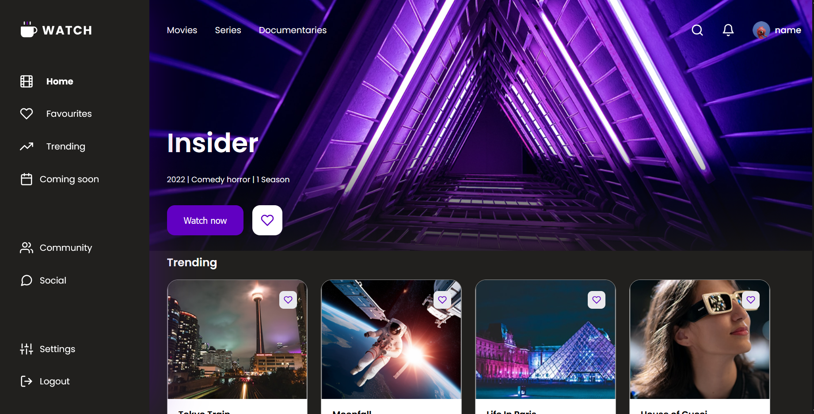

# 🎬 Movie Watchlist React App

An interactive movie watchlist application built with **React, JavaScript, and CSS Modules**.

## 🚀 Live Demo

[https://movie-watchlist-react-alpha.vercel.app/](https://movie-watchlist-react-alpha.vercel.app/)

## 🔗 Repository

https://github.com/darialozovska/movie-watchlist-react

## 📌 About the Project

This project is a movie dashboard application created as part of my React learning journey.

The goal was to practice building a multi-section React app, working with components, props, state, routing, favourites logic, and saving data in localStorage.

Users can browse movies, add them to favourites, open a trending movie page, view movie details, and keep their favourite movies saved after refreshing the page.

## 🛠 Tech Stack

- React
- JavaScript
- CSS Modules
- React Router
- LocalStorage
- Vite
- Git & GitHub
- Vercel
- Figma design reference

## ✨ Features

- Movie dashboard layout
- Fixed sidebar navigation
- Home page with hero, trending movies, and continue watching sections
- Favourites page
- Add and remove movies from favourites
- Favourite state saved in localStorage
- Trending page with selected movie details
- Dynamic movie cards rendered from data arrays
- Active navigation states
- SVG sprite icons
- Component-based structure
- Smooth hover and button interactions

## 📚 What I Learned

- How to create and organize React components
- How to pass data using props
- How to manage shared state with `useState`
- How to lift state up to a parent component
- How to render lists using `map()`
- How to use conditional rendering
- How to use React Router for page navigation
- How to save and load data with localStorage
- How to work with CSS Modules
- How to use SVG sprites in React

## 🔧 Future Improvements

- Add a login screen
- Add search functionality
- Improve responsive layout for mobile devices
- Add animations for page transitions
- Add real movie data from an API
- Improve accessibility

## 👩‍💻 Author

GitHub: https://github.com/darialozovska

## 📷 Screenshot

